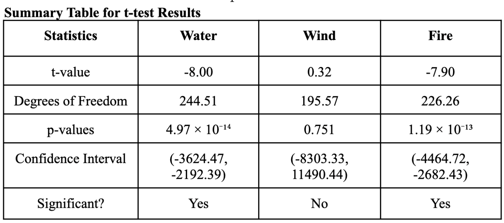

# Analysis of P&C Claim Loss Data

## Objective
The objective of this project is to evaluate whether property and casualty (P&C) claim loss severities differ between Arizona and Florida across Fire, Wind, and Water perils using statistical hypothesis testing, and to assess the actuarial implications of any statistically significant differences.

## Data Overview
The analysis uses P&C claim loss severity data for two states, Arizona and Florida, categorized by peril type: Fire, Wind, and Water. The study focuses on loss severity only and does not include claim frequency or exposure measures.

## Methodology
Two statistical approaches were used:
- Independent two-sample t-tests to compare mean loss severities between Arizona and Florida for each peril
- One-way ANOVA to analyze whether Fire loss severities differ significantly between states

Statistical significance was evaluated using p-values and confidence intervals.

## Key Results

### t-Test Findings
- Fire losses show a statistically significant difference between Arizona and Florida (p < 0.001)
- Water losses also show a statistically significant difference between the two states (p < 0.001)
- Wind losses do not show a statistically significant difference (p = 0.751)
- Confidence intervals for Fire and Water losses exclude zero, while the Wind loss interval includes zero

### ANOVA Findings (Fire Losses)
- The ANOVA test confirms a strong statistical difference in mean Fire losses between Arizona and Florida
- The F-statistic indicates that the variation between state means is substantially greater than the variation within states
- Florida exhibits significantly higher Fire loss severity than Arizona

## Actuarial Implications
The results suggest that geographic location should be considered an important rating variable for Fire and Water perils. Higher loss severities in Florida imply the need for higher base rates, stricter underwriting guidelines, and potentially higher deductibles for these perils.

From a portfolio risk management perspective, the elevated Fire and Water loss severities in Florida indicate greater tail risk, which may require increased reinsurance, tighter policy limits, and geographic diversification into lower-risk regions such as Arizona.

## Limitations
- The analysis includes data from only two states
- Loss frequency and exposure measures are not considered
- Statistical assumptions such as normality and independence may be violated due to skewness or event clustering
- Additional uncontrolled rating variables may differ between states

These results should be interpreted as directional insights rather than production-ready pricing factors.

---

## Statistical Test Screenshots

The following screenshots provide visual evidence of the statistical analyses
(t-tests and ANOVA) used to support the findings in this project.

### t-test Results

### ANOVA Results

